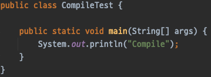
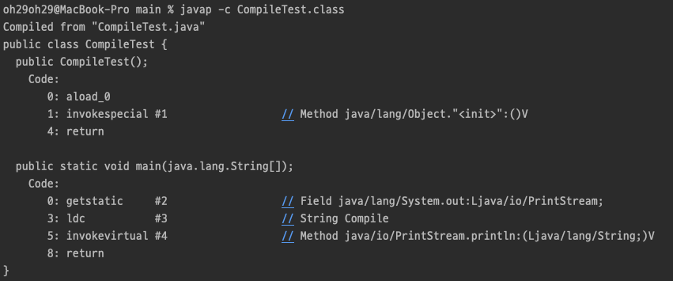
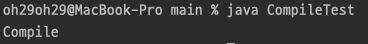
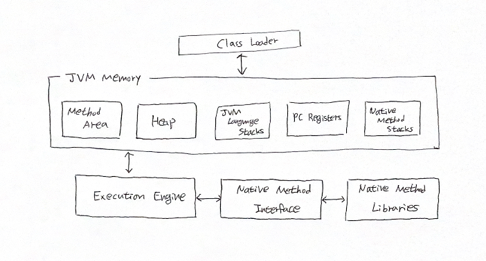

# JVM

Java Virtual Machine 의 약자.  
자바 바이트코드를 실행할 수 있는 런타임 환경을 제공한다.    
보통 VM 스펙이라고 하는 자바 가상 머신을 규정한 명세서에 따르면 JVM은 스택 기반의 해석 머신이다.

### 두 가지 특징
JVM은 자바 프로그램이 어느 기기 또는 운영체제 상에서도 실행될 수 있게 한다.  
프로그램 메모리를 관리하고 최적화하는 기능을 제공한다.  

### 바이트코드란?

자바 바이트코드(Java bytecode)란 JVM 이 이해할 수 있는 언어로 변환된 자바 소스 코드를 의미한다.  
자바 컴파일러에 의해 변환되는 코드의 명령어 크기가 1바이트라서 자바 바이트코드라고 불리고 있다.  
이런 자바 바이트코드의 확장자는 .class 이다.

### 바이트코드 실행

자바 컴파일러 javac 를 이용해 컴파일을 한다.  
javac 가 하는 일은 자바 소스 코드를 바이트코드로 된 .class 파일로 바꾸는 일이다.  

컴파일된 클래스 파일 안에는 클래스 파일의 메이저/마이너 버전이 명시되어 있다.
실행되는 클래스 파일의 메이저/마이너 버전은 클래스로더의 호환성 보장을 위해 검사하고 호환되지 않은 버전의 클래스라면 런타임에 UnsupportedClassVersionError 예외가 발생한다.  
죽, 런타임 버전이 컴파일된 클래스 파일의 버전보다 낮으면 동작하지 않는다.

  
위와 같은 자바 소스 코드를 컴파일하면 CompileTest.class 파일이 생성된다.    

컴파일된 .class 파일에 대하여 javap -c 명령어를 사용하면 위와 같이 바이트코드가 작성되어 있는 것을 확인할 수 있다.  

  
이렇게 컴파일된 .class 에 대하여 java 명령어를 사용하면 실행할 수 있다.  

### 핫스팟 JVM

자바는 썬 마이크로시스템즈가 개발했지만, JVM 명세를 따르기만 하면 어떤 회사에서든 JVM 을 개발하고 제공할 수 있다.  
그중 하나인 JVM 으로 핫스팟 JVM 이 있다.  

### JIT 컴파일

자바 프로그램은 바이트코드 인터프리터가 가상화한 스택 머신에서 명령어를 실행하며 시작된다.  
프로그램이 성능을 최대한 내려면 네이티브 기능을 활용해 CPU 에서 직접 프로그램을 실행시켜야 한다.  

이를 위해 핫스팟은 프로그램 단위(메서드와 루프)를 인터프리티드 바이트코드에서 네이티브 코드로 컴파일한다.  
바로 JIT(Just-in-Time) 컴파일이라고 알려진 기술이다.  

핫스팟은 인터프리티드 모드로 실행하는 동안 애플리케이션을 모니터링하면서 가장 자주 실행되는 코드 파트를 발견해 JIT 컴파일을 수행한다.  
이렇게 분석을 하는 동안 미리 프로그래밍한 추적 정보가 취합되면서 더 정교하게 최적화를 할 수 있다.

### JVM 구성 요소

  

#### Class Loader
TBD

#### Method Area
TBD

#### Heap
TBD

#### JVM Language Stacks
TBD

#### PC Registers
TBD

#### Native Method Stacks
TBD

#### Execution Engine
TBD

#### Native Method Interface
TBD

#### Native Method Libraries
TBD

### 클래스로딩

java HelloWorld 명령을 내려 자바 애플리케이션을 실행하면 OS는 가상 머신 프로세스(자바 바이너리)를 구동한다.  
자바 가상 환경이 구성되고 스택 머신이 초기화된 다음, 실제로 개발자가 작성한 HelloWorld 클래스 파일이 실행된다.

자바 프로세스가 새로 초기화되면 사슬처럼 줄지어 연결된 클래스로더가 차례차례 작동한다.  
제일 먼저 부트스트랩 클래스가 자바 런타임 코어 클래스를 로드한다.  
런타임 코어 클래스는 자바8 이전까지는 rt.jar 에서 가져오지만, 자바9 이후부터는 런타임이 모듈화되고 클래스로딩 개념 자체가 많이 달라졌다.

부트스트랩 클래스로더의 주임무는  
다른 클래스로더가 나머지 시스템에 필요한 클래스를 로드할 수 있게 최소한의 필수 클래스(ex. java.lang.Object, Class, Classloader)만 로드하는 것이다.

그다음, 확장 클래스로더가 생긴다.  
부트스트랩 클래스로더를 자기 부모로 설정하고 필요할 때 클래스로딩 작업을 부모에게 넘긴다.

끝으로, 애플리케이션 클래스로더가 생성되고 지정된 클래스패스에 위치한 유저 클래스를 로드한다.

자바는 프로그램 실행 중 처음 보는 새 클래스를 디펜던시에 로드한다.  
클래스를 찾지 못한 클래스로더는 기본적으로 자신의 부모 클래스로더에게 대신 룩업을 넘기고,  
이렇게 부모의 부모로 거슬러 올라가 결국 부트스트랩도 룩업하지 못하면 ClassNotFoundException 예외가 발생한다.

### JDK 와 JRE
TBD

### JVM 메모리 관리

자바는 가비지 컬렉션(Garbage Collection, GC) 이라는 프로세스를 이용해 힙 메모리를 자동 관리한다.  
가비지 컬렉션이란 JVM 이 더 많은 메모리를 할당해야 할 때 불필요한 메모리를 회수하거나 재사용하는 불확정적 프로세스이다.

지금까지 많은 GC 알고리즘이 개발되었고 응용되었다.  
GC가 실행되면 그동안 다른 애플리케이션은 모두 중단되고 하던 일은 멈춰야 한다.  

### GC
TBD

##### 참고
[javatpoint | jvm-java-virtual-machine](https://www.javatpoint.com/jvm-java-virtual-machine)  
[JVM | What is Java Virtual Machine & its Architecture](https://www.guru99.com/java-virtual-machine-jvm.html)
