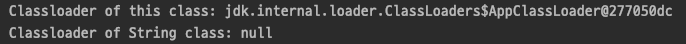

# JVM

Java Virtual Machine 의 약자.  
자바 바이트코드를 실행할 수 있는 런타임 환경을 제공한다.    
보통 VM 스펙이라고 하는 자바 가상 머신을 규정한 명세서에 따르면 JVM은 스택 기반의 해석 머신이다.

## 두 가지 특징
JVM은 자바 프로그램이 어느 기기 또는 운영체제 상에서도 실행될 수 있게 한다.  
프로그램 메모리를 관리하고 최적화하는 기능을 제공한다.  

## 바이트코드란?

자바 바이트코드(Java bytecode)란 JVM 이 이해할 수 있는 언어로 변환된 자바 소스 코드를 의미한다.  
자바 컴파일러에 의해 변환되는 코드의 명령어 크기가 1바이트라서 자바 바이트코드라고 불리고 있다.  
이런 자바 바이트코드의 확장자는 .class 이다.

## 바이트코드 실행

자바 컴파일러 javac 를 이용해 컴파일을 한다.  
javac 가 하는 일은 자바 소스 코드를 바이트코드로 된 .class 파일로 바꾸는 일이다.  

컴파일된 클래스 파일 안에는 클래스 파일의 메이저/마이너 버전이 명시되어 있다.
실행되는 클래스 파일의 메이저/마이너 버전은 클래스로더의 호환성 보장을 위해 검사하고 호환되지 않은 버전의 클래스라면 런타임에 UnsupportedClassVersionError 예외가 발생한다.  
즉, 런타임 버전이 컴파일된 클래스 파일의 버전보다 낮으면 동작하지 않는다.

  
위와 같은 자바 소스 코드를 컴파일하면 CompileTest.class 파일이 생성된다.    

컴파일된 .class 파일에 대하여 javap -c 명령어를 사용하면 위와 같이 바이트코드가 작성되어 있는 것을 확인할 수 있다.  

  
이렇게 컴파일된 .class 에 대하여 java 명령어를 사용하면 실행할 수 있다.  

## 핫스팟 JVM

자바는 썬 마이크로시스템즈가 개발했지만, JVM 명세를 따르기만 하면 어떤 회사에서든 JVM 을 개발하고 제공할 수 있다.  
그중 하나인 JVM 으로 핫스팟 JVM 이 있다.  

## JIT 컴파일

자바 프로그램은 바이트코드 인터프리터가 가상화한 스택 머신에서 명령어를 실행하며 시작된다.  
프로그램이 성능을 최대한 내려면 네이티브 기능을 활용해 CPU 에서 직접 프로그램을 실행시켜야 한다.  

이를 위해 핫스팟은 프로그램 단위(메서드와 루프)를 인터프리티드 바이트코드에서 네이티브 코드로 컴파일한다.  
바로 JIT(Just-in-Time) 컴파일이라고 알려진 기술이다.  

핫스팟은 인터프리티드 모드로 실행하는 동안 플리케이션을 모니터링하면서 가장 자주 실행되는 코드 파트를 발견해 JIT 컴파일을 수행한다.  
이렇게 분석을 하는 동안 미리 프로그래밍한 추적 정보가 취합되면서 더 정교하게 최적화를 할 수 있다.

## JVM 구성 요소

  

### Class Loader
클래스로더는 런타임 중에 자바 클래스 파일을 JVM 에 동적으로 로드하는 데 사용되는 하위 시스템이다.  
또한 JRE 의 일부이기도 하다. 따라서 클래스로더 덕분에 JVM 은 자바 애플리케이션을 실행하기 위한 기본 파일이나 파일 시스템에 대해 알 필요가 없다.  

자바 클래스는 한 번에 모두 메모리에 로드되는것이 아니라 애플리케이션에서 필요로 할 때 로드된다.

기본적으로 세 가지의 클래스로더가 존재한다. 부트스트랩 클래스로더, 확장 클래스로더, 애플리케이션 클래스로더.  
다음은 다양한 클래스가 어떤 클래스로더들을 사용하여 로드되어지는지 간단한 예제이다.  

  
위와 같이 직접 생성한 ClassLoaderTest 클래스와 자바에서 제공해주는 String 클래스에 대하여 각각 어떤 클래스로더가 사용되어 지는지 확인해 보았다.  

  
직접 생성한 ClassLoaderTest 클래스는 애플리케이션 클래스로더가 사용되었고, String 클래스는 부트스트랩 클래스로더가 사용된 것을 알 수 있다.  
이외 확장 클래스로더도 존재하는데, 알맞은 클래스를 찾지 못해 예제에 구현은 해보지 못했다. 추후 알게되면 추가할 예정이다.  

#### 부트스트랩 클래스로더

Primordial 클래스로더라고도 불리며, 세 가지 클래스로더 중 최상위 클래스로더이다.  
JDK 내부 클래스들을 로드하는 일을 하며, 일반적으로 rt.jar 와 $JAVA_HOME/jre/lib 디렉토리에 존재하는 코어 라이브러리들을 로드한다.  
또한, 코어 JVM 의 일부이며 네이티브 코드로 구현되었다.

#### 확장 클래스로더

부트스트랩 클래스로더의 하위 클래스로더이며, 표준 코어 자바 클래스들을 확장한 클래스들을 로드한다.
일반적으로 $JAVA_HOME/lib/ext 디렉토리 또는 java.ext.dirs 시스템 속성으로 지정된 경로의 디렉토리에 속한 클래스들을 로드한다.

#### 애플리케이션 클래스로더

확장 클래스로더의 하위 클래스로더이며, classpath 환경 변수, -classpath 또는 -cp 명령어로 찾은 클래스들을 로드한다.

### 클래스로딩

java HelloWorld 명령을 내려 자바 애플리케이션을 실행하면 OS는 가상 머신 프로세스(자바 바이너리)를 구동한다.  
자바 가상 환경이 구성되고 스택 머신이 초기화된 다음, 실제로 개발자가 작성한 HelloWorld 클래스 파일이 실행된다.

자바 프로세스가 새로 초기화되면 사슬처럼 줄지어 연결된 클래스로더가 차례차례 작동한다.  
제일 먼저 부트스트랩 클래스가 자바 런타임 코어 클래스를 로드한다.  
런타임 코어 클래스는 자바8 이전까지는 rt.jar 에서 가져오지만, 자바9 이후부터는 런타임이 모듈화되고 클래스로딩 개념 자체가 많이 달라졌다.

부트스트랩 클래스로더의 주임무는  
다른 클래스로더가 나머지 시스템에 필요한 클래스를 로드할 수 있게 최소한의 필수 클래스(ex. java.lang.Object, Class, Classloader)만 로드하는 것이다.

그다음, 확장 클래스로더가 생긴다.  
부트스트랩 클래스로더를 자기 부모로 설정하고 필요할 때 클래스로딩 작업을 부모에게 넘긴다.

끝으로, 애플리케이션 클래스로더가 생성되고 지정된 클래스패스에 위치한 유저 클래스를 로드한다.

자바는 프로그램 실행 중 처음 보는 새 클래스를 디펜던시에 로드한다.  
클래스를 찾지 못한 클래스로더는 기본적으로 자신의 부모 클래스로더에게 대신 룩업을 넘기고,  
이렇게 부모의 부모로 거슬러 올라가 결국 부트스트랩도 룩업하지 못하면 ClassNotFoundException 예외가 발생한다.

### Method Area

런타임 상수 풀, 메서드의 코드와 같은 클래스 별 구조를 저장한다.  
모든 쓰레드에서 공유한다.

### Heap
힙은 런타임 데이터 영역으로 생성된 객체와 그 객체들과 관련된 인스턴스 변수들 그리고 배열들이 힙에 저장된다.  
모든 쓰레드에서 공유한다.  
힙에서 저장하고 있는 객체들은 GC 에 의해 자동으로 관리된다. 

### JVM Language Stacks
각 쓰레드가 생성될 때 동시에 생성되는 자체 메모리 영역으로, 메서드의 결과와 반환값을 저장하거나 지역변수를 저장하는 용도로 쓰인다.  

### PC Registers
현재 실행중인 JVM 명령어의 주소를 저장한다.  
각 쓰레드마다 별도의 PC 레지스터가 존재한다.  

### Native Method Stacks
자바 이외의 네이티브 언어로 작성된 코드를 저장한다.  

### Execution Engine
클래스로더를 통해 JVM 메모리 영역에 배치된 바이트코드들을 명령어 단위로 읽어들여서 실행한다.  
JIT 컴파일이 바로 이곳에서 이루어진다.

## JDK 와 JRE

JRE (Java Runtime Environment)  
- 컴파일된 자바 애플리케이션을 실행시킬 수 있는 자바 환경
- JVM 이 자바 애플리케이션을 동작시킬 때 필요한 라이브러리 파일들과 기타 파일들을 갖고 있다.

JDK (Java Development Kit)
- 개발을 위해 필요한 도구(javac, java 등등)들을 포함한다.  
- JRE 도 포함되어 있다.

## JVM 메모리 관리

자바는 가비지 컬렉션(Garbage Collection, GC) 이라는 프로세스를 이용해 힙 메모리를 자동 관리한다.  
가비지 컬렉션이란 JVM 이 더 많은 메모리를 할당해야 할 때 불필요한 메모리를 회수하거나 재사용하는 불확정적 프로세스이다.

지금까지 많은 GC 알고리즘이 개발되었고 응용되었다.  
GC가 실행되면 그동안 다른 애플리케이션은 모두 중단되고 하던 일은 멈춰야 한다.  

JVM 메모리 관리의 근간을 형성하는 약한 세대별 가설(Weak Generational Hypothesis) 가 있다.  
- 대부분의 객체는 금방 접근 불가능 상태(unreachable)가 된다.
- 오래된 객체에서 젊은 객체로의 참조는 아주 적게 존재한다.

이 가설의 장점을 살리기 위해 핫스팟 JVM 에서는 메모리의 물리적 공간을 2개로 나누었다.

Young Generation 영역
- 새롭게 생성한 객체의 대부분이 위치하며, 대부분의 객체가 금방 접근 불가능 상태가 되기 때문에 많은 객체가 Young 영역에 생성되었다가 사라진다.
- 이 영역에서 객체가 사라질 때 Minor GC 가 발생한다고 말한다.

Old Generation 영역
- Young Generation 영역에서 접근 불가능 상태로 되지 않아 살아남은 객체가 복사된다.
- 이 영역에서 객체가 사라질 때 Major GC(또는 Full GC) 가 발생한다고 말한다.

## Garbage Collection

가비지 컬렉션은 JVM 힙 메모리 영역에서 사용 가능한 모든 객체를 추적하고 쓸모없어진 객체를 제거하는 역할을 맡고있다.

가비지 컬렉션 구현체는 반드시 두 가지 원칙을 준수해야 한다.
1. 알고리즘은 반드시 모든 가비지를 수잽해야 한다.
2. 사용중인 객체는 절대로 수집해선 안된다.  

일반적으로 가비지 컬렉션은 마크 앤 스위프(mark and sweep) 알고리즘을 기본으로 한다. 
Mark: 사용중인 객체와 그렇지 않은 객체를 식별한다.  
Sweep: Mark 단계에서 식별된 쓸모없어진 객체를 메모리에서 제거한다.  

#### Stop-The-World

GC 사이클이 발생하여 가비지를 수집하는 동안에는 모든 애플리케이션 쓰레드가 중단된다.

#### GC 종류

Serial GC
- 가장 단순한 GC 로 싱글 쓰레드로 동작한다. 따라서 Serial GC 가 수행되는 동안 다른 쓰레드들은 멈춘다.
- 따라서, 서버 환경과 같은 멀티 쓰레드 애플리케이션에서는 사용하지 않는다.
- Mark-Sweep-Compaction 알고리즘을 사용한다.

Parallel GC
- JVM 의 기본 GC 이며 멀티 쓰레드로 동작하는 GC 이다. 하지만 Parallel GC 역시 수행되는 동안 다른 쓰레드들은 멈춘다.
- Serial GC 보다 속도가 빠른 장점이 있고 머리 쓰레드 애플리케이션에 적합하다.
- Serail GC 와 마찬가지로 Mark-Sweep-Compaction 알고리즘을 사용한다.

Parallel Old GC
- Parallel GC 를 조금 더 개선한 GC 이다.
- Mark-Sweep-Compaction 알고리즘보다 더 개선된 Mark-Summary-Compaction 알고리즘을 사용하며, Summary 단계에서는 이미 GC 가 수행된 영역에서 살아있는 객체를 식별하는 작업을 진행한다는 점이 Sweep 과 다르다. 

CMS(Concurrent Mark Sweep) GC
- STW 시간을 아주 짧게 하려고 설계된 Old Generation 전용 GC 이다.
- 중단 시간을 최소화하기 위해 애플리케이션 쓰레드 실행 중에 가급적 많은 일을 한다.
- CMS GC 수행에는 4단계가 존재한다.
    - Initial Mark: 클래스로더에서 가장 가까운 객체 중 살아 있는 개체만 찾는다.
    - Concurrent Mark: 방금 살아있다고 확인한 객체에서 참조하고 있는 객체들을 따라가면서 확인한다. 다른 쓰레드가 실행 중인 상태에서 동시에 진행된다.
    - Remark: Concurrent Mark 단계에서 새로 추가되거나 참조가 끊긴 객체를 확인한다.
    - Concurrent Sweep: 가비지를 정리한다. 이 단계에서도 다른 쓰레드가 실행 중인 상태에서 동시에 진행된다.
- 위와 같은 단계로 진행되기 때문에 STW 시간이 매우 짧아 애플리케이션의 응답 속도가 매우 중요할 때 사용하는 GC 이다.
- 반면 다른 GC 방식보다 CPU 와 메모리를 더 많이 사용하며, Compaction 단계가 기본적으로 제공되지 않는다는 단점이 있다.
- 자바 9 부터는 CMS GC 를 더이상 사용되지 않는다. (그 이유는 좀 더 찾아보고 추가할 예정)

G1(Garbage First) GC
- 임의의 바둑판의 각 영역에 객체를 할당하고 GC 를 수행한다. 해당 바둑판 영역이 가득차면 다른 영역에서 객체를 할당하고 GC 를 수행한다.
- CMS GC 를 대체하기 위해서 만들어졌다.
- 위에서 나열한 GC 방식보다 빠르다.

> 웹 문서
> - [javatpoint | jvm-java-virtual-machine](https://www.javatpoint.com/jvm-java-virtual-machine)
> - [JVM | What is Java Virtual Machine & its Architecture](https://www.guru99.com/java-virtual-machine-jvm.html)
> - [Baeldung | Class Loaders in Java](https://www.baeldung.com/java-classloaders)
> - [JVM 메모리 구조와 GC](https://johngrib.github.io/wiki/jvm-memory/)
>
> 도서
> - [자바 최적화](http://www.kyobobook.co.kr/product/detailViewKor.laf?mallGb=KOR&ejkGb=KOR&barcode=9791162241776&orderClick=LA6)

